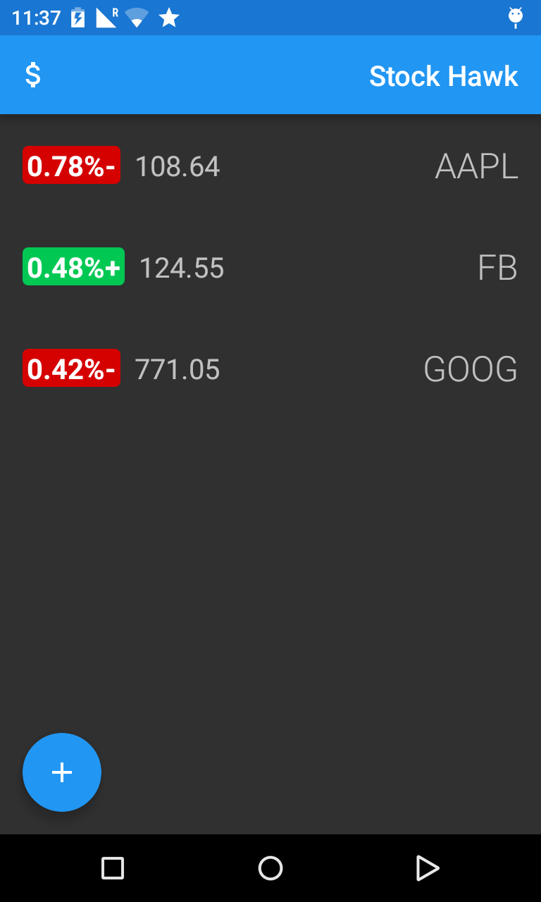

# Project 3: StockHawk

 An Android app for monitoring stocks using stock data from Yahoo Finance API. This project is designed to practice the skills required in improving app quality, taking a working app into a production-ready state, given a set of user feedbacks. 

**User Feedback for Stock Hawk:**
* Hellen says: "Right now I can't use this app with my screen reader. My friends love it, so I would love to download it, but the buttons don't tell my screen reader what they do."

* Your boss says: "We need to prepare Stock Hawk for the Egypt release. Make sure our translators know what to change and make sure the Arabic script will format nicely."

* Adebowale says: "Stock Hawk allows me to track the current price of stocks, but to track their prices over time, I need to use an external program. It would be wonderful if you could show more detail on a stock, including its price over time."

* Gundega says: "I use a lot of widgets on my Android device, and I would love to have a widget that displays my stock quotes on my home screen."

* Jamal says: "I found a bug in your app. Right now when I search for a stock quote that doesn't exist, the app crashes."

* Xaio-lu says: "When I opened this app for the first time without a network connection, it was a confusing blank screen. I would love a message that tells me why the screen is blank or whether my stock quotes are out of date."

* See [project description](https://github.com/udacity/Project-Descriptions-for-Review/blob/master/Android/Stock%20Hawk.md) for more detail.

**[Download APK and Try it](./readme/StockHawk-prod.apk)**, and compare with the [StockHawk before improvement](./readme/StockHawk-beta.apk)

## List of improvements
### Finding and handling error cases
The app would crash when the user searches for non-existing stock symbols, because the app did not expect non-numeric string to be return as a stock price. This is fixed by handling such cases gracefully, then a toast message is displayed to inform the user that the searched stock symbol doesn't exist.

Another error is when the searched stock symbol is an empty string. Eventhough it doesn't crash the app, but still it caused JSONException. The same error handling technic is used along with a toast message informing user.

 

### Empty Views
There are cases that no stock quotes is displayed on the screen. Without any message telling the user what is going on, the user could have difficulty using the app which could lead to the app being uninstalled. To fix the problem, three cases of empty view is added to inform the user what is happening.

  

### Adding app widget (homescreen widget)
By providing the App widget, periodically updated stock quotes can be viewed on homescreen without having to launch the application, which is very convenient for the users. Also, it could improve user engagement for the app. In this project, a collection widget displaying all stocks quotes of the user is built. The widget is a scrollable list of stock quotes which can be resized to show 2 or 3 columns of information. On the widget, the user can go directly into each stock detail page by tapping at the stock quote, or into the application main stock listing page by tapping at its header.

  

### Adding stock chart
In the stock detail page, a line chart showing changes of the stock adjusted close price in the past 3 months is added. In order to draw the line chart, a third party library [WilliamChart](https://github.com/diogobernardino/WilliamChart) is used.

### Test and complete accessibility (A11y) features
Android provides accessibility features and services for helping the users with disability navigate their devices easier. These include TalkBack, the Google screen reader. TalkBack help the users navigate the screen without looking at the screen by reading out description of each element the user touches. The app has not yet support TalkBack for all buttons. Therefore, to improve the app's quality, the app is tested throughly with TalkBack, and the content description is improved where possible, and is also added on a button that was missed out.

### Allowing for localization (L10n) 
As the majority of Android's billion users are more comfortable with the user interface in their non-English native languages on their devices. Making the app support Localization is very important in expanding target users. In this project, to support localization the following has been improved.
* All strings are moved into strings.xml, ready to be translated into local languages.
* Added support for Right-To-Left (RTF) text so that the app is ready to be localized for Right-To-Left languages like Arabic, Hebrew and etc.

  

**Skill required:** _Error Handling, Empty View, Localization, Accessibility, Collection App Widget, Third party Library (Schematics, WilliamChart)_

**Remark:** This application is Ratanachai's work for Udacity [Android Developer Nanodegree program](https://www.udacity.com/course/android-developer-nanodegree-by-google--nd801)
